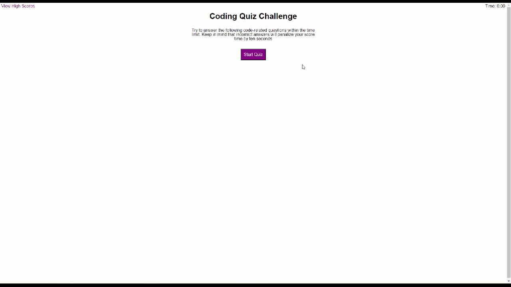

# Mod-4-JSQuiz

## Description

A brief 10 question coding quiz that is timed.  When the user answers a question incorrectly, there is a 10 second penalty. The top 10 high scores (fastest times) are saved and displayed.

## Installation

N/A - Project is deployed to https://tannernd.github.io/Mod-4-JSQuiz/

## Usage

The following image shows the web application's appearance and functionality:

## Credits

N/A

## License

N/A
